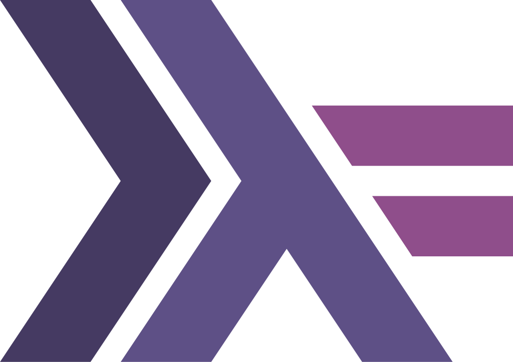

#  Paradigma Funcional

El **Paradigma Funcional** es un estilo de programación que ve la computación como la evaluación de funciones matemáticas.  La idea es trabajar con funciones puras y evitar cambiar datos, lo que hace que el código sea más predecible y fácil de razonar.

En la cursada usamos **Haskell**, un lenguaje totalmente funcional, ideal para aprender estos conceptos.

Si querés probar Haskell en tu compu, acá te dejo cómo instalarlo de forma sencilla:

### Cómo instalar Haskell

1. Lo más fácil es usar [GHCup](https://www.haskell.org/ghcup/), que es el instalador oficial para Haskell.

2. Si usás **Windows**, podés abrir PowerShell y pegar este comando para arrancar la instalación:

    ```bash
    Set-ExecutionPolicy Bypass -Scope Process -Force; Invoke-Expression ((New-Object System.Net.WebClient).DownloadString('https://get-ghcup.haskell.org'))
    ```

   > **🚨 Importante:** PowerShell suele bloquear la ejecución de scripts por seguridad, por eso usamos `Set-ExecutionPolicy Bypass` para permitirlo temporalmente solo en esa sesión. Si tenés errores, proba ejecutarlo como **administrador**.

3. Después, solo seguí las instrucciones del instalador para tener Haskell listo para usar.

Si querés más detalles, podés entrar al [sitio oficial de GHCup](https://www.haskell.org/ghcup/) o preguntarle a tu profesor/a.

### 🛡 Detalle personal sobre antivirus

En mi caso, **Kaspersky** me bloqueaba silenciosamente la instalación, y después nada funcionaba bien.

Si tenés algún antivirus, fijate si está interfiriendo, y considerá agregar una excepción si hace falta.

> No soy muy partidario de desactivar el antivirus para instalar cosas, pero esto es algo de la facultad (toca confiar).


